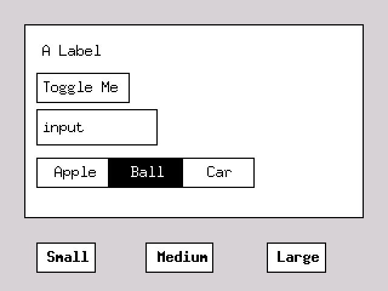

# Untitled Embedded Rust GUI

## What is This?

This is a new GUI library for no_std embedded Rust. I currently have it running on
the ESP32-S3 based Lilygo T-Deck, but it should run on anything that uses embedded_graphics.
The library manages a scene of views and has built in components for:

* button
* label
* text input (text box)
* panel
* toggle button
* toggle group

`View`s are rendered using a `Theme` which can be customized for different
colors and font sizes.  Views carry their own internal state using an
optional `state` struct. Application state should remain outside the scene/view structure
and be handled by processing actions emitted from the scene when events happen.

To make it flexible, the lib **does not** impose its own event loop. Instead, the application
should send events to the scene and then redraw in its own loop. **Better documentation coming**. 

## Usage

Build the library with `cargo build`.

Run the simulator example with `cargo run --example simulator --features std`. Note that
the simulator needs SDL2. [Install instructions](https://docs.rs/embedded-graphics-simulator/latest/embedded_graphics_simulator/).

Run the unit tests with `cargo test --features std`.

## Themes

`Theme` is a struct passed to every View's `draw` function. It stores the standard colors and fonts for drawing.
However, these are just guidelines. A view can feel free to ignore them and draw whatever it wants.
The theme fields should be used for:

* **bg**: the background of components like buttons and text inputs.
* **fg**: the foreground of components, which usually means the text color.
* **panel_bg**: the background of panels and other containers. Depending on the theme this may or may not be the same as *bg*.
* **font**: the default font used for all text.
* **bold_font**: the bold variant of the current font. Used for button titles.
* **selected_bg**: a background color used to indicate something is selected.
* **selected_fg**: a text color used to indicate something is selected. Usually used with `selected_bg`.

## Roadmap

- [x] Remove generics for color and font. Just use embedded graphics directly.
- [x] use simulator for interactive tests
- [x] use MockDisplay for automated tests
- [x] support layout using font size. needs padding in the widgets.
- [x] add hbox and vbox layouts
- [x] make children drawn and picked relative to the parent.
- [ ] general
  - [ ] setup CI on github actions.
- [ ] more components
  - [x] add menu view
  - [x] add list view
  - [ ] add tab panel
  - [ ] popup menu / dropdown box 
- [ ] input improvements
  - [ ] cleanup event types and action command signatures.
  - [ ] document how to make your own event & draw loop
- [ ] text input
  - [ ] move cursor within text
  - [ ] forward and backward delete
  - [ ] selection?
- [ ] focus management 
  - [ ] use scroll events to jump between focused elements and perform selection.
  - [ ] spec out how focus management works. 
    - [ ] focus groups
- [ ] drawing
  - [x] redo fill_text api.
    - [x] just text. support bg color?
    - [x] proper alignment. provide center point and draw centered
  - [x] draw line
  - [x] remove clear
  - [x] consolidate Display impls
- [ ] layout & rendering
  - [ ] calculating dirty rect needs to be converted back to global
  - [ ] view padding and margins?
  - [ ] view border control? just on and off? custom colors?
  - [x] form layout -> grid layout
    - [x] debug lines
    - [ ] alignment within grid cells
    - [x] span grid cells
- [ ] improved custom view support
  - [ ] view can define the children it uses
    - [ ] let tab panel define its own children using a toggle group
  - [ ] let tab panel switch its own tabs instead of using external handle action
- [ ] theme
  - [x] support selected fg and bg colors
  - [ ] accent colors?

## Architecture

### Grid Layout Architecture

* A child view determines its own size
* A parent view determines the position of the child.
* The grid has rows and columns. 
* Views are placed at specific cells referenced by a `row` and `col`.
* Views can span multiple rows or columns using `row_span` and `col_span`.
* Views are aligned within the cells they are positioned at using `h_align` and `v_align` fields.
* To make a view stretch to fill a cell, use the `stretch` variant of the alignment.

## tasks

* In case of tabs the child panel gets it's size from the parent, but it needs to know it's
own size during layout, so how can it find out this information? passed from the parent
during the layout phase?
