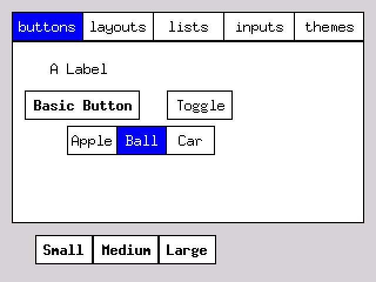

# Iris-UI



## What is This?

Iris a new UI library for no_std embedded Rust. I currently have it running on
the ESP32-S3 based [Lilygo T-Deck](https://github.com/Xinyuan-LilyGO/T-Deck/tree/master), but it should run on anything
that uses the [embedded_graphics traits](https://docs.rs/embedded-graphics/latest/embedded_graphics/).
It focuses on bandwidth limited devices, such as SPI displays.

## Features

* Incremental redrawing using layout and dirty rect tracking.
* Built in components for buttons, labels, text input, toggles, and panels.
* Theming with colors and fonts
* Scene to manage a tree of View structs
* Fast single pass layout algorithm

## Anti-Features

* **event loop:** To make it flexible, the lib **does not** impose its own event loop. Instead, the application
  should send events to the scene and then redraw in its own loop. See [Event Loop](#event-loop) below;
* **animation:** The library has no support for animation or transparency because those will perform horribly on
  bandwidth
  limited SPI displays.

## Usage

### Use as a crate

Add the crate `iris-ui` to your `Cargo.toml` file then `use iris_ui::*` in your code. Check
out the [example code](examples).

### Building and running locally

Build the library with `cargo build`.

Run the simulator example with `cargo run --example simulator --features std`. Note that
the simulator needs
SDL2. [Install instructions](https://docs.rs/embedded-graphics-simulator/latest/embedded_graphics_simulator/).

Run the unit tests with `cargo test --features std`.

The library has not yet been released as a published crate because I still need
a name and need to fix some bugs.

## Views

`View`s are rendered using a `Theme` which can be customized for different
colors and font sizes. Views carry their own internal state using an
optional `state` struct. Application state should remain outside the scene/view structure
and be handled by processing actions emitted from the scene when events happen.

Instead of implementing a trait you create components by
allocating a `View` is with optional fields for functions to handle
input, state, layout, and drawing. This is the code that creates a button (as implemented in the
library provided `make_button`):

```rust
pub fn make_button(name: &ViewId, title: &str) -> View {
    View {
        name: name.clone(),
        title: title.to_string(),
        // the button will determine its own width
        h_flex: Intrinsic,
        // the button will determine its own height
        v_flex: Intrinsic,
        // on tap, requested to be focused
        input: Some(|e| {
            if let EventType::Tap(_pt) = &e.event_type {
                e.scene.set_focused(e.target);
                return Some(Action::Generic);
            }
            None
        }),
        // size self based on the font and the title text
        layout: Some(|e| {
            if let Some(view) = e.scene.get_view_mut(&e.target) {
                view.bounds.size = util::calc_size(e.theme.bold_font, &view.title);
            }
        }),
        // delegate drawing to a draw_button function
        draw: Some(draw_button),
        ..Default::default()
    }
}

fn draw_button(e: &mut DrawEvent) {
    e.ctx.fill_rect(&e.view.bounds, &e.theme.bg);
    e.ctx.stroke_rect(&e.view.bounds, &e.theme.fg);
    if let Some(focused) = e.focused {
        if focused == &e.view.name {
            e.ctx.stroke_rect(&e.view.bounds.contract(2), &e.theme.fg);
        }
    }
    draw_centered_text(
        e.ctx,
        &e.view.title,
        &e.view.bounds,
        &e.theme.bold_font,
        &e.theme.fg,
    );
}
```

## Custom Views

All views are just instances of the `View` struct. To create a custom view build a View with custom `state`, `input`,
`layout`, and `draw` fields. This example creates a simple progress bar.

First create a struct to represent the internal state of the progress bar:

```rust
// struct for the state of the progress bar
struct ProgressState {
    value: f32,
}
```

Now make a function to return a view with custom attributes.

```rust
fn make_progress_bar(name: &ViewId) -> View {
    View {
        name: name.clone(),

        // set the state
        state: Some(Box::new(ProgressState {
            value: 0.0,
        })),

        // no input
        input: None,

        // fixed size layout
        layout: Some(|e| {
            if let Some(view) = e.scene.get_view_mut(e.target) {
                view.bounds.size = Size::new(100, 20);
            }
        }),

        // draw progress bar
        draw: Some(|e| {
            e.ctx.fill_rect(&e.view.bounds, &e.theme.bg);
            let full = e.view.bounds.size;
            // get the state to calculate the fill width
            if let Some(state) = e.view.get_state::<ProgressState>() {
                let w = (full.w as f32 * state.value) as i32;
                let bd2 = Bounds::new_from(e.view.bounds.position, Size::new(w, full.h));
                e.ctx.fill_rect(&bd2, &e.theme.selected_bg);
            }
            e.ctx.stroke_rect(&e.view.bounds, &e.theme.fg);
        }),

        // use defaults for the rest of the attributes
        ..Default::default()
    }
}
```

Now call the function to build the view and add it to your scene.

```rust
fn make_progressbar() {
    let progress_id = ViewId::new("progress_bar");
    scene.add_view_to_root(make_progress_bar(&progress_id));
}
```

When the state of progress needs to change, update the state inside of a `get_view_state()` call.

```rust
fn update_progressbar() {
    // update the progress bar every 100 msec
    if let Some(state) = scene.get_view_state::<ProgressState>(&progress_id) {
        state.value += 0.01;
        if state.value > 1.0 {
            state.value = 0.0;
        }
        scene.mark_dirty_view(&progress_id);
        sleep(Duration::from_millis(100));
    }
}
```

See the full example code in [examples/custom_view.rs](examples/custom_view.rs).

## Themes

`Theme` is a struct passed to every View's `draw` function. It stores the standard colors and fonts for drawing.
However, these are just guidelines. A view can feel free to ignore them and draw whatever it wants.
The theme fields should be used for:

* **bg**: the background of components like buttons and text inputs.
* **fg**: the foreground of components, which usually means the text color.
* **panel_bg**: the background of panels and other containers. Depending on the theme this may or may not be the same as
  *bg*.
* **font**: the default font used for all text.
* **bold_font**: the bold variant of the current font. Used for button titles.
* **selected_bg**: a background color used to indicate something is selected.
* **selected_fg**: a text color used to indicate something is selected. Usually used with `selected_bg`.

## Event Loop

Iris does not provide its own event loop. Instead use whatever loop is provided by the environment you are using.
You will need to receive native input events (taps, button clicks, keyboard presses, etc.) and convert them
into Iris events. In a typical embedded environment it would look something like this:

```rust
#[main]
fn main() -> ! {
    // set up your board and display
    let mut display: Display<_> = make_display();

    // init your scene
    let mut scene = make_your_scene();

    // create a theme
    let theme = Theme {
        bg: Rgb565::WHITE,
        fg: Rgb565::BLACK,
        selected_bg: Rgb565::WHITE,
        selected_fg: Rgb565::BLACK,
        panel_bg: Rgb565::CSS_LIGHT_GRAY,
        font: FONT_6X10,
        bold_font: FONT_7X13_BOLD,
    };

    // make the drawing context from the display
    let mut ctx = EmbeddedDrawingContext::new(&mut display);

    // init the touch screen
    let touch = Gt911Blocking::default();
    touch.init(i2c_ref).unwrap();

    // event & render loop
    loop {

        // handle touch inputs
        if let Ok(point) = touch.get_touch(i2c_ref) {
            if let Some(point) = point {
                // flip because the screen is mounted sideways on the t-deck
                let pt = GPoint::new(320 - point.y as i32, 240 - point.x as i32);
                if let Some(result) = click_at(&mut scene, &vec![], pt) {
                    info!("view returned result {result:?}");
                }
            }
        }

        // set up the clip rect
        let delay_start = Instant::now();
        ctx.clip = scene.dirty_rect.clone();

        // draw the scene
        draw_scene(&mut scene, &mut ctx, &theme);

        // wait for 100 msec
        while delay_start.elapsed() < Duration::from_millis(100) {}
    }
}
```

## Roadmap

### 0.1

- [x] Remove generics for color and font. Just use embedded graphics directly.
- [x] use simulator for interactive tests
- [x] use MockDisplay for automated tests
- [x] support layout using font size. needs padding in the widgets.
- [x] add hbox and vbox layouts
- [x] make children drawn and picked relative to the parent.
- [x] general
    - [x] setup CI on github actions.
- [x] more components
    - [x] add menu view
    - [x] add list view
- [x] drawing
    - [x] redo fill_text api.
        - [x] just text. support bg color?
        - [x] proper alignment. provide center point and draw centered
    - [x] draw line
    - [x] remove clear
    - [x] consolidate Display impls
- [x] layout & rendering
    - [x] calculating dirty rect needs to be converted back to global
    - [x] common view padding
    - [x] new layout algoritm
    - [x] form layout -> grid layout
        - [x] debug lines
        - [x] alignment within grid cells
        - [x] span grid cells
- [x] pick final name

### 0.2

- [ ] input improvements
    - [ ] cleanup event types and action command signatures.
    - [x] document how to make your own event & draw loop
- [x] text input
    - [x] move cursor within text
    - [x] forward and backward delete
- [ ] focus management
    - [ ] use scroll events to jump between focused elements and perform selection.
    - [ ] spec out how focus management works.
        - [ ] focus groups
- [ ] improved custom view support
    - [ ] view can define the children it uses
        - [ ] let tab panel define its own children using a toggle group
    - [x] let tab panel switch its own tabs instead of using external handle action
- [ ] theme accent colors?


